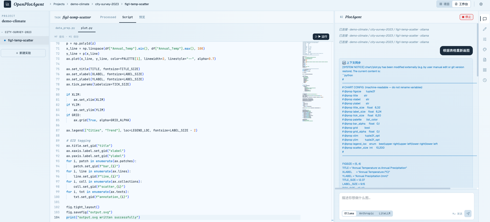
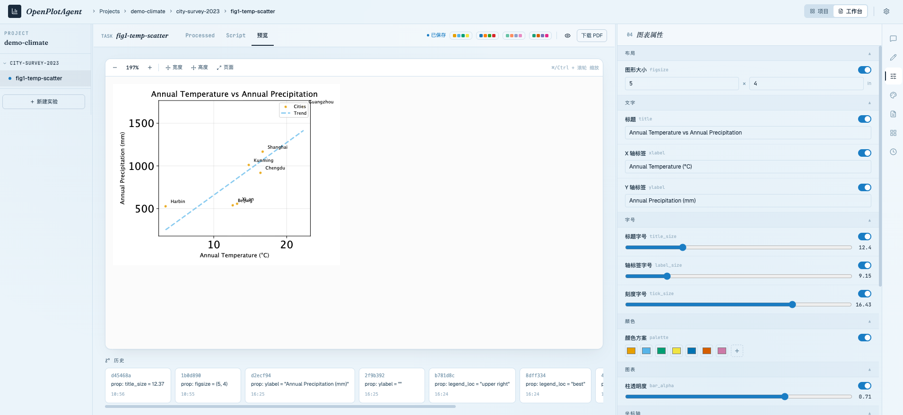
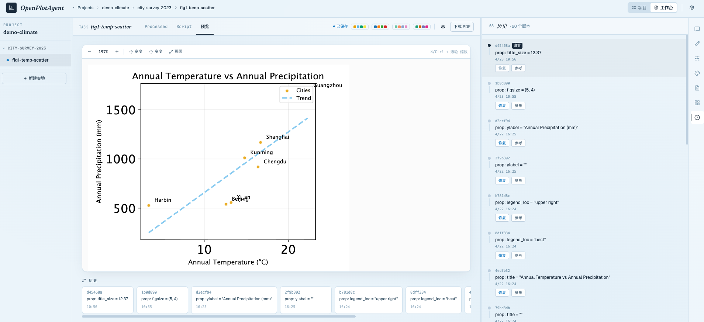
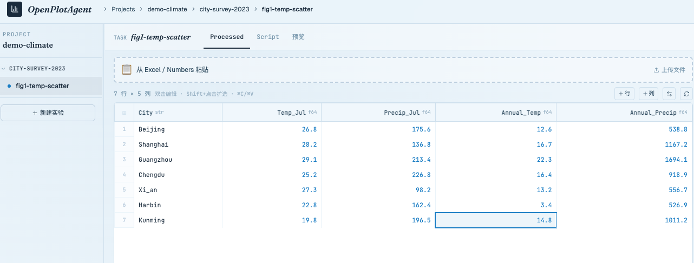

# OpenPlotAgent


**🌐 语言 / Language：** 当前：中文 ｜ [Switch to English](README_EN.md)

---

> **像在 Overleaf 里写论文一样画图** — 用对话驱动 AI 生成绘图脚本，随时接管手工调整，直接导出期刊投稿级 PDF，全程 Git 溯源。

---

## 界面预览

| Agent 对话与代码生成 | 图表预览与属性调整 |
|---|---|
|  |  |

| Git 版本历史 | Excel 风格数据表格 |
|---|---|
|  |  |

---

## 目录

- [项目简介](#项目简介)
- [核心特性](#核心特性)
- [技术栈](#技术栈)
- [项目结构](#项目结构)
- [安装与运行](#安装与运行)
- [配置说明](#配置说明)
- [工作流程](#工作流程)
- [API 文档](#api-文档)
- [数据存储结构](#数据存储结构)
- [Agent 工具列表](#agent-工具列表)
- [设计理念](#设计理念)

---

## 项目简介

OpenPlotAgent 是一款面向科研人员（研究生、博士后、PI）的 **AI 绘图助手**，深度整合 LaTeX 工作流、Python 生态和 Git 版本控制。

就像 Overleaf 之于论文写作——你在编辑器里描述意图，后台自动编译、即时预览、版本存档——OpenPlotAgent 对绘图做同样的事：用自然语言告诉 Agent "帮我画一个对比三组实验结果的箱线图，符合 Nature 投稿规范"，Agent 调用工具链自动完成数据探索、脚本生成、沙箱渲染，结果实时呈现。你可以随时接管：点击 SVG 元素调整样式，或直接修改 `plot.py`，最终一键导出期刊可用的 PDF。每一步变更自动提交至 Git，完全可复现。

与 Datawrapper、Flourish 等在线工具不同，OpenPlotAgent：

- **Human-in-the-Loop**：AI 脚本生成与手工可视化编辑无缝结合，而非黑盒自动化
- **透明的工具调用**：Agent 每一步操作（读数据、写代码、执行沙箱）实时流式展示，过程可审查
- **持久化 Agent 记忆**：三层记忆跨会话积累，Agent 越用越懂你的项目风格
- **隔离沙箱执行**：每个项目独立虚拟环境，代码安全运行，结果即时渲染
- **原生支持学术规范**（SVG/PDF 导出、PGF 后端、LaTeX 公式、期刊尺寸）
- **Git 全程溯源**，每次代码/数据/对话均自动提交

---

## 核心特性

### Human-in-the-Loop 人机协同

OpenPlotAgent 的核心设计理念：AI 负责繁琐的脚本编写与数据处理，人负责审美判断与精细调整，两者无缝衔接。

- 对话式绘图：用自然语言描述需求，Agent 自动完成数据探索、代码生成、图表渲染
- 可视化接管：点击任意 SVG 元素直接修改颜色、字号、文字、线宽；双击标题/坐标轴标签在位编辑；拖拽图例到新位置；双击坐标轴快速设置 xlim/ylim
- 一键切换配色方案（后端 `/palette` 直接改写 `plot.py`，无需 LLM），支持自定义调色板保存
- **图表属性面板**：自动解析 `plot.py` 中的 `@prop` 注释，为标题、字号、颜色、图例、坐标范围等每个属性生成对应控件；每个属性带独立开关——关闭即从图中删除该元素（如关闭标题），开启后自动恢复；无需 LLM 即可直接微调图表
- Excel 风格数据表格：鼠标拖拽选区、Shift+点击扩选、Ctrl+A/C/V 全选复制粘贴、点击行号选整行、点击列名选整列、双击编辑单元格、右键插入/删除行、右键列名排序
- 代码编辑器：Monaco Editor + Python 语法高亮、行号、括号匹配、Ctrl+S 保存
- 选中数据/代码片段"添加到对话框"（非直接发送），附带来源标注后由用户决定何时发送
- 对话历史持久化：切换任务或刷新页面后完整恢复历史消息（含 thinking 过程），每次打开任务自动渲染已有 `plot.py`
- 四级记忆面板（全局 / 项目 / 实验 / 任务），可在 UI 中直接编辑 `.md` 记忆文件，Agent 每轮结束后自动刷新
- 支持中英文界面切换（UI 右上角设置）
- 8 种学术图表模板（柱状/折线/热力/箱线/散点/小提琴/堆叠/环形），一键生成 prompt
- Agent 感知人工编辑：手工改动会自动通知 Agent，保持上下文同步

### 论文可用的 PDF 导出

- 直接导出符合期刊投稿规范的 PDF（matplotlib PGF 后端）
- SVG 矢量格式，无限缩放不失真
- 预览区内置缩放工具栏：放大 / 缩小 / 100% / 适合宽度 / 适合高度 / 适合页面，Ctrl/⌘+滚轮缩放，大图自动出现滚动条
- 支持 LaTeX 数学公式渲染
- 默认 Okabe-Ito 色盲友好配色方案
- 可配置期刊规范尺寸（Nature、Science、IEEE 等）

### 透明工具调用

Agent 不是黑盒——每次调用工具都以流式方式实时展示在 Chat 面板，你始终知道 Agent 在做什么、为什么这么做。

Agent 具备完整的工具链（19 个工具），覆盖完整绘图流程：

- **数据层**：`summarize_data` 快速摘要 → `inspect_data` 探索结构 → `recommend_charts` 推荐图表类型 → `query_data` 筛选 → `transform_data` 清洗（12+ 种转换）→ `write_data` 落盘
- **执行层**：`execute_python` 在沙箱中运行代码 → `patch_config_prop` 安全修改 `@prop` 配置变量 → `render_chart` 重新渲染 SVG → `install_package` 动态安装依赖
- **版本层**：`git_log` 查看历史 → `git_diff` 对比变更 → `git_restore` 回退文件
- **记忆层**：`memory_read` 加载多层级上下文 → `memory_write` 持久化决策记录
- **检索层**：`search_charts` 语义搜索历史图表代码

工具调用过程、入参、输出均实时可见，支持中途干预——既能让 Agent 完整跑完，也能随时接管手工修改。

### Agent 持久化记忆

Agent 在四个层级上积累经验，跨会话持续生效：

| 层级 | 存储位置 | 记忆内容 |
| --- | --- | --- |
| **全局** | `~/.config/` | LLM 偏好、通用绘图习惯 |
| **项目** | `PROJECT.md` | 期刊规范、配色约定、坐标轴偏好 |
| **实验** | `EXPERIMENT.md` | 数据来源、实验背景、共享样式约定 |
| **任务** | `TASK.md` | 数据决策、历次调整的设计理由 |

同一个项目用得越久，Agent 对你的风格就越熟悉：不用重复解释期刊要求，不用每次指定字体，不用说明配色偏好。

### 隔离沙箱执行

每个项目拥有独立、隔离的 Python 运行环境，绘图代码在受控沙箱中执行：

- 基于 `uv` 的每项目独立虚拟环境，依赖互不污染
- 30 秒超时保护，防止意外死循环
- 支持 `install_package` 工具动态安装 pip 包，无需手动激活环境
- matplotlib 自动配置 SVG 后端，渲染结果即时回传前端预览

### 全程 Git 版本管理

- 每个项目独立 Git 仓库
- 代码编辑、数据变更、对话记录自动提交
- 支持查看 Diff、回退到任意历史版本

### 灵活的 LLM 后端

- **Anthropic Claude**（云端，推荐 claude-sonnet-4-6）
- **Ollama / Qwen3**（本地部署，支持 `<think>` 推理块）
- UI 内可随时切换 Provider 和模型，无需重启

---

## 技术栈

### 后端（Python）

| 组件 | 技术 |
|------|------|
| Web 框架 | FastAPI 0.115+、Uvicorn 0.34+ |
| LLM 接入 | Anthropic SDK、OpenAI SDK（兼容 Ollama） |
| 代码执行 | `uv` 虚拟环境 + subprocess 沙盒（30s 超时） |
| 数据处理 | pandas、numpy、scipy、seaborn |
| 绘图 | matplotlib（SVG/PDF/PGF 后端） |
| 版本控制 | GitPython 3.1+ |
| 异步 I/O | aiofiles、WebSocket |
| 数据验证 | Pydantic 2.0+ |
| 测试 | pytest、pytest-asyncio、httpx |

**Python 版本要求：≥ 3.11**

### 前端（JavaScript/React）

| 组件 | 技术 |
|------|------|
| 框架 | React 19.2、Vite 8.0 |
| 状态管理 | Zustand 5.0 |
| 样式 | Tailwind CSS 4.2 |
| 代码编辑器 | Monaco Editor 4.7（`@monaco-editor/react`） |
| 图标 | Lucide React 1.8 |
| 字体 | Fraunces、Geist、JetBrains Mono、Cormorant Garamond |

---

## 项目结构

```
open-plot-agent/
├── backend/                    # Python FastAPI 后端
│   ├── agent/
│   │   ├── providers/          # LLM 适配层（Anthropic / Ollama）
│   │   ├── tools/              # Agent 工具集（14 个工具）
│   │   └── loop.py             # Agent 主循环（流式 + 工具调用）
│   ├── sandbox/
│   │   └── runner.py           # 沙盒代码执行器
│   ├── git_manager/            # Git 操作封装
│   ├── main.py                 # FastAPI 路由（30+ 接口）
│   ├── config.py               # 配置管理
│   ├── workspace_init.py       # 项目目录初始化
│   └── pyproject.toml          # Python 依赖声明
├── frontend/                   # React + Vite 前端
│   ├── src/
│   │   ├── App.jsx             # 主界面（Dashboard + Workspace）
│   │   ├── components/         # 核心 UI 组件
│   │   │   ├── ChatPanel.jsx       # 对话面板（流式 + think 折叠 + 工具调用）
│   │   │   ├── SvgPreview.jsx      # SVG 预览 + 缩放 + 拖拽编辑
│   │   │   ├── ElementEditor.jsx   # 元素属性编辑器（颜色/字号/文字）
│   │   │   ├── PropertiesPanel.jsx # 图表属性面板（@prop 解析 + 开关控件）
│   │   │   ├── PalettePanel.jsx    # 配色方案面板（直接调用 /palette）
│   │   │   ├── DataPanel.jsx       # 原始数据 + Processed + Script 标签页
│   │   │   ├── DataGrid.jsx        # 自定义电子表格（拖拽选区/行列选择/右键菜单）
│   │   │   ├── CodeEditor.jsx      # Monaco Python 编辑器
│   │   │   ├── MemoryPanel.jsx     # 三级记忆编辑面板
│   │   │   ├── TemplatePanel.jsx   # 学术图表模板库
│   │   │   ├── ExperimentPanel.jsx # 实验视图
│   │   │   └── SettingsModal.jsx   # 模型设置弹窗
│   │   ├── hooks/
│   │   │   └── useAgentChat.js # WebSocket 通信 Hook
│   │   └── store/
│   │       └── index.js        # Zustand 全局状态
│   └── package.json
├── DesignSystem/               # 设计系统文档与组件展示
│   ├── README.md               # 设计规范（颜色、字体、间距）
│   └── ui_kits/                # React 组件 Showcase
└── doc/                        # 项目文档
    ├── PROJECT_OVERVIEW.md
    ├── REQUIREMENTS.md
    ├── UI_DESIGN.md
    └── UPGRADE_PLAN.md
```

---

## 安装与运行

### 前置依赖

- Python ≥ 3.11
- Node.js ≥ 18
- `uv`（Python 包管理器）：`pip install uv`
- 可选：[Ollama](https://ollama.ai)（本地 LLM）

### 1. 启动后端

```bash
cd backend/

# 安装 Python 依赖
pip install -e .

# （可选）包含开发依赖
pip install -e ".[dev]"

# 启动 FastAPI 服务（默认端口 8000）
uvicorn main:app --reload --port 8000
```

### 2. 启动前端

```bash
cd frontend/

# 安装 Node 依赖
npm install

# 启动开发服务器（默认端口 5173）
npm run dev

# 生产构建
npm run build
```

### 3. 配置 LLM

**使用 Claude（推荐）：**

```bash
export ANTHROPIC_API_KEY=your_api_key_here
```

**使用 Ollama 本地模型：**

```bash
# 安装并启动 Ollama
ollama pull qwen3.6:27b
ollama serve
```

然后在 UI 设置面板或配置文件中切换 Provider 为 `ollama`。

### 4. 访问应用

浏览器打开 [http://localhost:5173](http://localhost:5173)

---

## 配置说明

配置文件路径（按优先级）：

- `~/.config/open-plot-agent/config.toml`
- `~/open-plot-agent/config.toml`

```toml
# 最大工具调用轮次（防止无限循环）
max_tool_rounds = 8

[provider]
default = "anthropic"   # "anthropic" 或 "ollama"

[provider.anthropic]
model = "claude-sonnet-4-6"
api_key_env = "ANTHROPIC_API_KEY"   # 从环境变量读取
# api_key = "sk-ant-..."            # 或直接填写（不推荐）

[provider.ollama]
model = "qwen3:8b"
base_url = "http://localhost:11434/v1"
thinking = true           # 启用推理块（<think>）
thinking_budget = 4096    # 最大推理 token 数
```

也可以在 UI 的**设置面板**中直接修改上述配置，无需手动编辑文件。

---

## 工作流程

OpenPlotAgent 将科研绘图拆解为四步标准流程：

```
① 发现数据  →  ② 清洗处理  →  ③ 编写代码  →  ④ 执行渲染
   inspect        transform       write plot.py    execute_python
   query_data     write_data      (matplotlib)     render_chart
```

### 典型使用场景

1. **新建项目** — 在 Dashboard 创建项目（关联期刊规范、视觉风格）
2. **上传数据** — 在 Experiment 面板上传原始数据文件（CSV、Excel、JSON 等）
3. **创建任务** — 为每张图创建独立 Task，保持关注点分离
4. **对话绘图** — 在 Chat 面板描述需求，Agent 自动完成数据探索、代码生成、图表渲染
5. **可视化调整** — 在**图表属性**面板直接拨动开关调整标题/字号/图例等；点击 SVG 元素改颜色文字；或切换整体配色方案
6. **导出发布** — 下载 SVG 或 PDF（PGF 格式，兼容 LaTeX）

---

## API 文档

后端启动后访问 [http://localhost:8000/docs](http://localhost:8000/docs) 查看完整 Swagger 文档。

### 主要接口概览

#### 项目管理
| 方法 | 路径 | 说明 |
|------|------|------|
| `POST` | `/api/projects` | 创建项目 |
| `GET` | `/api/projects` | 列出所有项目 |

#### 实验管理
| 方法 | 路径 | 说明 |
|------|------|------|
| `POST` | `/api/projects/{pid}/experiments` | 创建实验 |
| `POST` | `/api/projects/{pid}/experiments/{eid}/data` | 上传原始数据文件 |
| `GET` | `/api/projects/{pid}/experiments/{eid}/raw/{fname}/preview` | 预览数据（前 200 行） |

#### 任务与图表
| 方法 | 路径 | 说明 |
|------|------|------|
| `POST` | `/api/projects/{pid}/experiments/{eid}/tasks` | 创建任务 |
| `GET` | `/api/projects/{pid}/experiments/{eid}/tasks/{tid}/chart/svg` | 获取当前 SVG |
| `POST` | `/api/projects/{pid}/experiments/{eid}/tasks/{tid}/render` | 重新渲染图表 |
| `POST` | `/api/projects/{pid}/experiments/{eid}/tasks/{tid}/palette` | 直接改写 `plot.py` 的配色（无需 LLM） |
| `GET` | `/api/projects/{pid}/experiments/{eid}/tasks/{tid}/config-props` | 读取 `plot.py` 中所有 `@prop` 声明及当前值 |
| `POST` | `/api/projects/{pid}/experiments/{eid}/tasks/{tid}/config-props` | 修改单个属性并重新渲染，返回新 SVG |
| `POST` | `/api/projects/{pid}/experiments/{eid}/tasks/{tid}/chart/auto-render` | 按需重渲染（`plot.py` 比 SVG 新时才重跑） |
| `GET` | `/api/projects/{pid}/experiments/{eid}/tasks/{tid}/chat-history` | 读取持久化对话历史 |
| `POST` | `/api/projects/{pid}/experiments/{eid}/tasks/{tid}/chat-history` | 保存对话历史 |
| `GET` | `/api/projects/{pid}/experiments/{eid}/tasks/{tid}/chart/export-pdf` | 导出 PDF |
| `GET`/`PUT` | `/api/projects/{pid}/experiments/{eid}/tasks/{tid}/files/{path}` | 读写任意任务文件（含 `TASK.md`、`chart/plot.py`） |

#### Git 操作
| 方法 | 路径 | 说明 |
|------|------|------|
| `GET` | `/api/projects/{pid}/git/log` | 查看提交历史 |
| `POST` | `/api/projects/{pid}/experiments/{eid}/tasks/{tid}/git/restore` | 回退文件到指定提交 |

#### Agent 实时对话
| 协议 | 路径 | 说明 |
|------|------|------|
| `WebSocket` | `/ws/{pid}/{eid}/{tid}?provider={name}` | 流式 Agent 对话 |

#### 系统设置
| 方法 | 路径 | 说明 |
|------|------|------|
| `GET` | `/api/settings` | 获取当前配置 |
| `POST` | `/api/settings` | 更新配置 |
| `GET` | `/health` | 健康检查 |

---

## 数据存储结构

所有数据存储在本地 `~/open-plot-agent/` 目录下：

```
~/open-plot-agent/
├── config.toml                             # 全局配置
└── projects/
    └── {project_id}/                       # 项目根目录
        ├── .git/                           # Git 仓库
        ├── .venv/                          # 独立 Python 虚拟环境
        ├── PROJECT.md                      # 项目记忆（期刊规范、视觉约定）
        └── experiments/
            └── {experiment_id}/
                ├── EXPERIMENT.md           # 实验记忆（数据来源、采集说明）
                ├── raw/                    # 原始数据文件
                └── tasks/
                    └── {task_id}/
                        ├── TASK.md         # 任务记忆（决策历史）
                        ├── processed/
                        │   └── data.csv    # 清洗后的数据（Agent 直接读取）
                        ├── chart/
                        │   ├── data_prep.py    # Stage 1：数据加载与清洗
                        │   ├── plot.py         # Stage 2：绘图代码（含 CHART CONFIG @prop 块）
                        │   └── output.svg      # 渲染输出
                        ├── chat_history.json   # 持久化对话历史（跨页面刷新保留，含 thinking 块）
                        └── .plotsmith/
                            └── context.json    # Agent 会话上下文（含历史工具调用）
```

---

## Agent 工具列表

Agent 具备以下 19 个工具：

### 数据处理工具
| 工具 | 说明 |
|------|------|
| `summarize_data` | 快速概览文件列数、数据类型与分布摘要，适合探索阶段 |
| `inspect_data` | 预览文件结构、列名、数据类型、统计摘要（详细版） |
| `recommend_charts` | 根据数据列结构（分类/数值/时间）推荐 2-4 种适合的图表类型 |
| `query_data` | 按列/条件筛选数据，支持限制返回行数 |
| `transform_data` | 12+ 种转换操作（前向填充、转置、透视、融合、重命名、删除列、数值转换等） |
| `write_data` | 将处理后的数据保存为 CSV |

### 文件操作工具
| 工具 | 说明 |
|------|------|
| `read_file` | 读取任意任务文件内容 |
| `write_file` | 写入文件内容 |
| `list_files` | 列出目录中的文件 |

### 图表生成工具
| 工具 | 说明 |
|------|------|
| `patch_config_prop` | 直接修改 `plot.py` 中的 `@prop` 配置变量并重新渲染（比 write_file 更安全） |
| `render_chart` | 重新运行 `plot.py` 并返回 SVG |
| `execute_python` | 在项目沙盒中执行 Python 代码（30s 超时） |
| `install_package` | 动态安装 pip 包到项目虚拟环境 |

### Git 版本控制工具
| 工具 | 说明 |
|------|------|
| `git_log` | 查看提交历史记录 |
| `git_diff` | 对比两个版本的差异 |
| `git_restore` | 将文件回退到指定提交版本 |

### 记忆工具
| 工具 | 说明 |
|------|------|
| `memory_read` | 读取持久化记忆（scope: global / project / experiment / task） |
| `memory_write` | 向指定层级写入或追加记忆内容 |

### RAG 工具
| 工具 | 说明 |
|------|------|
| `search_charts` | 用语义相似度在历史生成的图表代码中搜索参考案例 |

---

## 设计理念

OpenPlotAgent 遵循以下核心设计原则：

- **接口密度是特性** — 紧凑的信息密度，无动画、无插图，专注于精确操作
- **Git 作为基础设施** — 版本控制不是可选项，而是工作流的核心组成
- **可切换的 AI 后端** — 不绑定特定 LLM，支持在 Claude 和本地模型间自由切换
- **记忆随项目积累** — Agent 在三个层级（全局/项目/任务）积累偏好，越用越懂你

