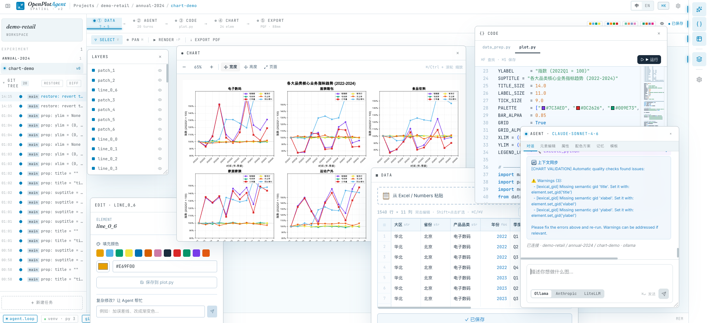

# OpenPlotAgent


**🌐 Language / 语言：** Current: English ｜ [切换到中文](README.md)

---

> **Plot figures the way you write papers in Overleaf** — describe your figure in conversation, let the Agent generate and run the script, step in to refine visually, and export a journal-ready PDF. Full Git provenance throughout.

---

## Screenshots



> **Spatial v2 design**: three-column grid — left sidebar (experiment tree + Git graph) | central workspace | right actions rail. All panels (chart preview, code, data, layers, element editor, agent chat) are independent floating windows — draggable, resizable, and stackable; clicking any window brings it to the front.

---

## Table of Contents

- [Introduction](#introduction)
- [Key Features](#key-features)
- [Tech Stack](#tech-stack)
- [Project Structure](#project-structure)
- [Installation & Setup](#installation--setup)
- [Configuration](#configuration)
- [Workflow](#workflow)
- [API Reference](#api-reference)
- [Data Storage Layout](#data-storage-layout)
- [Agent Tool Reference](#agent-tool-reference)
- [Design Philosophy](#design-philosophy)

---

## Introduction

OpenPlotAgent is an **AI plotting assistant** built for researchers (graduate students, postdocs, PIs) who live in LaTeX, Python, and the terminal. It deeply integrates with Python's scientific ecosystem and Git version control.

Think of it as Overleaf for figures. Just as Overleaf lets you describe your document in LaTeX, compiles it in the cloud, and keeps every version — OpenPlotAgent lets you describe your figure in plain language, runs the plotting script in an isolated sandbox, and commits every change to Git. Tell the Agent "draw a boxplot comparing three experimental groups, following Nature submission guidelines" — it calls its tool chain to explore the data, write the code, and render the result in real time. Step in whenever you want: click SVG elements to adjust styles, or edit `plot.py` directly, then export a journal-ready PDF in one click.

Unlike online tools such as Datawrapper or Flourish, OpenPlotAgent:

- **Human-in-the-Loop** — AI script generation and manual visual editing work together seamlessly, not a black-box automation
- **Transparent tool calls** — every Agent action (read data, write code, run sandbox) streams live so the process is always auditable
- **Persistent Agent memory** — three-tier memory accumulates across sessions; the Agent learns your project style over time
- **Isolated sandbox execution** — per-project virtual environment, code runs safely, results render instantly
- **Natively supports academic standards** (SVG/PDF export, PGF backend, LaTeX formulas, journal-specific dimensions)
- **Full Git provenance** — every code edit, data change, and conversation is auto-committed

---

## Key Features

### Spatial v2 Interface

The redesigned workspace uses a three-column grid with every functional panel as a floating window:

- **Three-column grid**: left sidebar (experiment tree + color-coded Git branch graph) | central workspace (pipeline bar + toolbar + canvas) | right actions rail (Agent / Code / Data / Layers / Settings shortcuts)
- **Full-width pipeline bar**: shows ① DATA → ② AGENT → ③ CODE → ④ CHART → ⑤ EXPORT across the top; click any node to jump to that panel
- **All floating windows are draggable, resizable, and stackable** — clicking any window brings it to the front (z-index stack):
  - **◉ CHART**: SVG chart preview; proportional scaling follows window resize automatically
  - **{} CODE**: code editor floating window
  - **▦ DATA**: data table floating window
  - **LAYERS**: layers panel; clicking a layer entry opens a dedicated property editor popup for that element
  - **EDIT · gid**: element property editor (color, font size, text, line width)
  - **AGENT**: multi-tab panel — Chat / Edit / Properties / Palette / Memory / Templates
- **Color-coded Git branch graph** embedded in the sidebar: main (blue) / agent (purple) / manual (orange); click any commit to restore

### Human-in-the-Loop

The core design principle: AI handles the tedious scripting and data processing; you handle aesthetic judgment and fine-tuning — the two work together seamlessly.

- Conversational plotting: describe what you need, Agent handles data exploration, code generation, and rendering
- Visual takeover: click any SVG element to directly edit colors, font sizes, text, and line widths; double-click titles and axis labels for in-place editing; drag the legend to reposition it; double-click an axis to quickly set xlim/ylim
- **Layers panel integration**: click any entry in the LAYERS panel (title, legend, xaxis, etc.) to open a dedicated EDIT property editor for that element; alternatively, clicking an SVG element directly opens the Agent's edit tab
- One-click color scheme switching (server-side `/palette` rewrites `plot.py` without LLM); save custom palettes
- **Chart Properties panel**: auto-parses `@prop` annotations in `plot.py` and generates UI controls for each property (title, font sizes, colors, legend, axis ranges, etc.); each property has its own toggle — disabling it removes the element from the chart, enabling it restores it; no LLM needed for fine-tuning
- Excel-style data table: drag to select cells, Shift+click to extend selection, Ctrl+A/C/V, click row numbers to select entire rows, click column headers to sort, double-click to edit, right-click to insert/delete rows
- Monaco Editor with Python syntax highlighting, line numbers, bracket matching, Ctrl+S to save
- Context-aware selection: select data or code snippets and "add to chat" with source attribution — you decide when to send
- Persistent chat history: full message history (including thinking blocks) is restored when switching tasks or refreshing the page; existing `plot.py` is auto-rendered on task open
- Four-tier memory panel (global / project / experiment / task): edit `.md` memory files directly in the UI; panel auto-refreshes after each agent turn
- 8 academic chart templates (grouped bar, line, heatmap, boxplot, scatter, violin, stacked bar, donut) — one click generates a starter prompt
- Agent-aware manual edits: handmade changes automatically notify the Agent to keep context in sync
- Chinese/English UI switching (top-right settings panel)

### Paper-Ready PDF Export

- Export PDFs that meet journal submission standards (matplotlib PGF backend)
- SVG vector format — infinitely scalable without quality loss
- LaTeX math formula rendering support
- Default Okabe-Ito colorblind-friendly palette
- Configurable journal-specific dimensions (Nature, Science, IEEE, etc.)

### Transparent Tool Calls

The Agent is not a black box — every tool call streams live in the Chat panel so you always know what it's doing and why.

The Agent has a complete tool chain (19 tools) covering the full plotting workflow:

- **Data layer**: `summarize_data` quick overview → `inspect_data` explores structure → `recommend_charts` suggests chart types → `query_data` filters → `transform_data` cleans (12+ operations) → `write_data` saves
- **Execution layer**: `execute_python` runs code in the sandbox → `patch_config_prop` safely updates `@prop` config variables → `render_chart` re-renders SVG → `install_package` installs dependencies on demand
- **Version layer**: `git_log` browses history → `git_diff` compares versions → `git_restore` reverts files
- **Memory layer**: `memory_read` loads multi-level context → `memory_write` persists decisions
- **RAG layer**: `search_charts` searches past chart code by semantic similarity

Tool inputs and outputs are visible in real time, and you can intervene at any point — let the Agent run to completion or take over manually at any step.

### Persistent Agent Memory

The Agent accumulates knowledge at four levels, persisting across sessions:

| Level | Location | What it remembers |
| --- | --- | --- |
| **Global** | `~/.config/` | LLM preferences, general plotting habits |
| **Project** | `PROJECT.md` | Journal specs, color conventions, axis preferences |
| **Experiment** | `EXPERIMENT.md` | Data source, collection notes, shared style conventions |
| **Task** | `TASK.md` | Data decisions, design rationale from past iterations |

The longer you use a project, the better the Agent knows your style — no need to re-explain journal requirements, fonts, or color preferences each time.

### Isolated Sandbox Execution

Each project runs in its own isolated Python environment, with plotting code executed in a controlled sandbox:

- Per-project `uv` virtual environment — dependencies never bleed between projects
- 30-second timeout prevents accidental infinite loops
- `install_package` tool installs pip packages on demand without manually activating the environment
- matplotlib automatically configured with the SVG backend; rendered output streams back to the frontend instantly

### Full Git Version Control

- Each project has its own isolated Git repository
- Code edits, data changes, and conversation logs are automatically committed
- Browse diff, restore any file to any previous commit

### Flexible LLM Backend

- **Anthropic Claude** (cloud, recommended: claude-sonnet-4-6)
- **Ollama / Qwen3** (local deployment, with `<think>` reasoning block support)
- Switch provider and model anytime from the UI settings panel — no restart required

---

## Tech Stack

### Backend (Python)

| Component | Technology |
|-----------|------------|
| Web Framework | FastAPI 0.115+, Uvicorn 0.34+ |
| LLM Integration | Anthropic SDK, OpenAI SDK (Ollama-compatible) |
| Code Execution | `uv` venv + subprocess sandbox (30s timeout) |
| Data Processing | pandas, numpy, scipy, seaborn |
| Chart Generation | matplotlib (SVG/PDF/PGF backends) |
| Version Control | GitPython 3.1+ |
| Async I/O | aiofiles, WebSocket |
| Data Validation | Pydantic 2.0+ |
| Testing | pytest, pytest-asyncio, httpx |

**Python version requirement: ≥ 3.11**

### Frontend (JavaScript/React)

| Component | Technology |
|-----------|------------|
| Framework | React 19.2, Vite 8.0 |
| State Management | Zustand 5.0 |
| Styling | Tailwind CSS 4.2 |
| Icons | Lucide React 1.8 |
| Fonts | Fraunces, Geist, JetBrains Mono, Cormorant Garamond |

---

## Project Structure

```
open-plot-agent/
├── backend/                    # Python FastAPI backend
│   ├── agent/
│   │   ├── providers/          # LLM adapters (Anthropic / Ollama)
│   │   ├── tools/              # Agent tool registry (14 tools)
│   │   └── loop.py             # Agent main loop (streaming + tool dispatch)
│   ├── sandbox/
│   │   └── runner.py           # Sandboxed code executor
│   ├── git_manager/            # Git operation wrappers
│   ├── main.py                 # FastAPI routes (30+ endpoints)
│   ├── config.py               # Configuration management
│   ├── workspace_init.py       # Project directory initializer
│   └── pyproject.toml          # Python dependency declaration
├── frontend/                   # React + Vite frontend
│   ├── src/
│   │   ├── App.jsx             # Main UI: 3-column grid + all floating panels (useDraggable / useZStack / FloatPanel)
│   │   ├── index.css           # Spatial v2 design system (oklch color tokens, grid layout, float panel styles)
│   │   ├── components/         # Core UI components
│   │   │   ├── ChatPanel.jsx       # Chat panel (streaming + thinking blocks + tool call display)
│   │   │   ├── SvgPreview.jsx      # SVG preview (ResizeObserver proportional zoom + legend drag + in-place edit)
│   │   │   ├── ElementEditor.jsx   # SVG element property editor (color / font size / text / stroke)
│   │   │   ├── PropertiesPanel.jsx # @prop annotation parser + toggle controls
│   │   │   ├── PalettePanel.jsx    # Color scheme panel (calls /palette directly, no LLM)
│   │   │   ├── DataPanel.jsx       # Data + Script tabs
│   │   │   ├── DataGrid.jsx        # Excel-style spreadsheet (drag selection / row-column select / context menu)
│   │   │   ├── CodeEditor.jsx      # Monaco Python editor
│   │   │   ├── MemoryPanel.jsx     # Four-tier memory editor
│   │   │   ├── TemplatePanel.jsx   # Academic chart template library (8 types)
│   │   │   ├── ExperimentPanel.jsx # Experiment view
│   │   │   └── SettingsModal.jsx   # Model & config settings modal
│   │   ├── hooks/
│   │   │   └── useAgentChat.js # WebSocket communication hook
│   │   └── store/
│   │       └── index.js        # Zustand global state
│   └── package.json
├── DesignSystem/               # Design system docs & component showcase
│   ├── README.md               # Design tokens (colors, fonts, spacing)
│   └── ui_kits/                # React component showcase
└── doc/                        # Project documentation
    ├── PROJECT_OVERVIEW.md
    ├── REQUIREMENTS.md
    ├── UI_DESIGN.md
    └── UPGRADE_PLAN.md
```

---

## Installation & Setup

### Prerequisites

- Python ≥ 3.11
- Node.js ≥ 18
- `uv` (Python package manager): `pip install uv`
- Optional: [Ollama](https://ollama.ai) for local LLM support

### 1. Start the Backend

```bash
cd backend/

# Install Python dependencies
pip install -e .

# (Optional) Include dev dependencies
pip install -e ".[dev]"

# Launch FastAPI server (default port 8000)
uvicorn main:app --reload --port 8000
```

### 2. Start the Frontend

```bash
cd frontend/

# Install Node dependencies
npm install

# Start dev server (default port 5173)
npm run dev

# Production build
npm run build
```

### 3. Configure Your LLM

**Using Claude (recommended):**

```bash
export ANTHROPIC_API_KEY=your_api_key_here
```

**Using a local Ollama model:**

```bash
# Install and start Ollama
ollama pull qwen3:8b
ollama serve
```

Then switch the provider to `ollama` in the UI settings panel or config file.

### 4. Open the App

Navigate to [http://localhost:5173](http://localhost:5173) in your browser.

---

## Configuration

Config file locations (by priority):

- `~/.config/open-plot-agent/config.toml`
- `~/open-plot-agent/config.toml`

```toml
# Maximum tool call rounds per agent turn (prevents infinite loops)
max_tool_rounds = 8

[provider]
default = "anthropic"   # "anthropic" or "ollama"

[provider.anthropic]
model = "claude-sonnet-4-6"
api_key_env = "ANTHROPIC_API_KEY"   # Read from environment variable
# api_key = "sk-ant-..."            # Or hardcode directly (not recommended)

[provider.ollama]
model = "qwen3:8b"
base_url = "http://localhost:11434/v1"
thinking = true           # Enable reasoning blocks (<think>)
thinking_budget = 4096    # Max reasoning tokens
```

All settings can also be changed directly from the **Settings panel** in the UI.

---

## Workflow

OpenPlotAgent breaks academic figure creation into four standard steps:

```
① Discover Data  →  ② Clean & Process  →  ③ Write Code  →  ④ Execute & Render
   inspect_data       transform_data        write plot.py     execute_python
   query_data         write_data            (matplotlib)      render_chart
```

### Typical Usage

1. **Create a Project** — Set up a project in the Dashboard (associate journal specs and visual style)
2. **Upload Data** — Upload raw data files (CSV, Excel, JSON, etc.) in the Experiment panel
3. **Create a Task** — Create one Task per figure to maintain separation of concerns
4. **Chat to Plot** — Describe your needs in the Chat panel; the Agent handles data exploration, code generation, and rendering automatically
5. **Visual Refinement** — Toggle properties in the Chart Properties panel (title, font sizes, legend, axis limits); click SVG elements to edit colors or text; drag the legend to reposition; swap the entire color scheme
6. **Export** — Download SVG or PDF (PGF format, LaTeX-compatible)

---

## API Reference

After starting the backend, visit [http://localhost:8000/docs](http://localhost:8000/docs) for the full interactive Swagger documentation.

### Endpoint Overview

#### Project Management
| Method | Path | Description |
|--------|------|-------------|
| `POST` | `/api/projects` | Create a project |
| `GET` | `/api/projects` | List all projects |

#### Experiment Management
| Method | Path | Description |
|--------|------|-------------|
| `POST` | `/api/projects/{pid}/experiments` | Create an experiment |
| `POST` | `/api/projects/{pid}/experiments/{eid}/data` | Upload a raw data file |
| `GET` | `/api/projects/{pid}/experiments/{eid}/raw/{fname}/preview` | Preview data (first 200 rows) |

#### Tasks & Charts
| Method | Path | Description |
|--------|------|-------------|
| `POST` | `/api/projects/{pid}/experiments/{eid}/tasks` | Create a task |
| `GET` | `/api/projects/{pid}/experiments/{eid}/tasks/{tid}/chart/svg` | Get current SVG |
| `POST` | `/api/projects/{pid}/experiments/{eid}/tasks/{tid}/render` | Re-render chart |
| `GET` | `/api/projects/{pid}/experiments/{eid}/tasks/{tid}/chart/export-pdf` | Export PDF |

#### Git Operations
| Method | Path | Description |
|--------|------|-------------|
| `GET` | `/api/projects/{pid}/git/log` | View commit history |
| `POST` | `/api/projects/{pid}/experiments/{eid}/tasks/{tid}/git/restore` | Restore file to a commit |

#### Real-Time Agent Chat
| Protocol | Path | Description |
|----------|------|-------------|
| `WebSocket` | `/ws/{pid}/{eid}/{tid}?provider={name}` | Streaming agent conversation |

#### System Settings
| Method | Path | Description |
|--------|------|-------------|
| `GET` | `/api/settings` | Get current configuration |
| `POST` | `/api/settings` | Update configuration |
| `GET` | `/health` | Health check |

---

## Data Storage Layout

All data is stored locally under `~/open-plot-agent/`:

```
~/open-plot-agent/
├── config.toml                             # Global configuration
└── projects/
    └── {project_id}/                       # Project root
        ├── .git/                           # Git repository
        ├── .venv/                          # Isolated Python virtual environment
        ├── PROJECT.md                      # Project memory (journal specs, visual conventions)
        └── experiments/
            └── {experiment_id}/
                ├── EXPERIMENT.md           # Experiment memory (data source, collection notes)
                ├── raw/                    # Original data files
                └── tasks/
                    └── {task_id}/
                        ├── TASK.md         # Task memory (decision history)
                        ├── processed/
                        │   └── data.csv    # Cleaned data (Agent reads this directly)
                        ├── chart/
                        │   ├── data_prep.py    # Stage 1: data loading & cleaning
                        │   ├── plot.py         # Stage 2: plotting code (with CHART CONFIG @prop block)
                        │   └── output.svg      # Rendered output
                        ├── chat_history.json   # Persistent chat history (survives page refresh, incl. thinking)
                        └── .plotsmith/
                            └── context.json    # Agent session context (tool call history)
```

---

## Agent Tool Reference

The Agent has access to 19 tools:

### Data Processing Tools
| Tool | Description |
|------|-------------|
| `summarize_data` | Quick overview of column count, data types, and distribution — ideal for the exploration phase |
| `inspect_data` | Detailed preview of file structure, column names, data types, and statistics |
| `recommend_charts` | Analyze a data file and recommend 2-4 appropriate chart types based on column structure |
| `query_data` | Filter data by columns/conditions with row limit support |
| `transform_data` | 12+ transformation operations (forward_fill, transpose, pivot, melt, rename, drop, to_numeric, fillna, etc.) |
| `write_data` | Save processed data as CSV |

### File Operation Tools
| Tool | Description |
|------|-------------|
| `read_file` | Read any task file |
| `write_file` | Write content to a file |
| `list_files` | List files in a directory |

### Chart Generation Tools
| Tool | Description |
|------|-------------|
| `patch_config_prop` | Directly update a `@prop` config variable in `plot.py` and re-render (safer than write_file) |
| `render_chart` | Re-run `plot.py` and return the SVG |
| `execute_python` | Execute Python code in the project sandbox (30s timeout) |
| `install_package` | Dynamically install a pip package into the project venv |

### Git Version Control Tools
| Tool | Description |
|------|-------------|
| `git_log` | View commit history |
| `git_diff` | Compare two versions of a file |
| `git_restore` | Restore a file to a specific commit |

### Memory Tools
| Tool | Description |
|------|-------------|
| `memory_read` | Load persistent memory (scope: global / project / experiment / task) |
| `memory_write` | Write or append content to a memory scope |

### RAG Tools
| Tool | Description |
|------|-------------|
| `search_charts` | Search past successfully generated chart code by semantic similarity |

---

## Design Philosophy

OpenPlotAgent is guided by the following core principles:

- **Spatial v2 workspace** — floating-window first; every tool panel is independently draggable, resizable, and stackable; z-index stack management brings the last-clicked window to the front; the canvas itself is a free-form surface
- **Interface density is a feature** — Compact information density, no decorative animations, precision-focused; oklch color system ensures cross-display consistency
- **Git as infrastructure** — Version control is not optional; the color-coded branch graph is embedded in the sidebar, and any commit can be restored in one click
- **Swappable AI backend** — Not locked to any specific LLM; freely switch between Claude and local models
- **Memory accumulates with projects** — The Agent builds up preferences across four levels (global / project / experiment / task), getting smarter the more you use it


